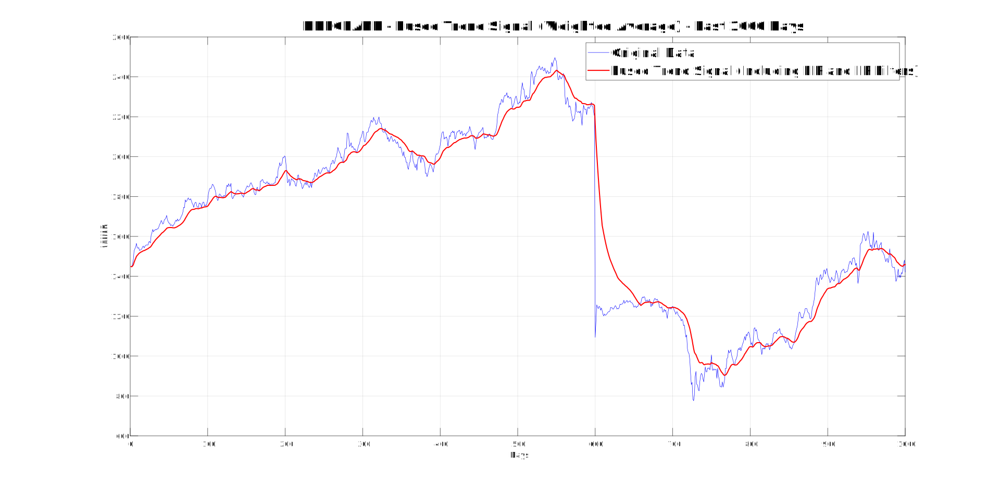
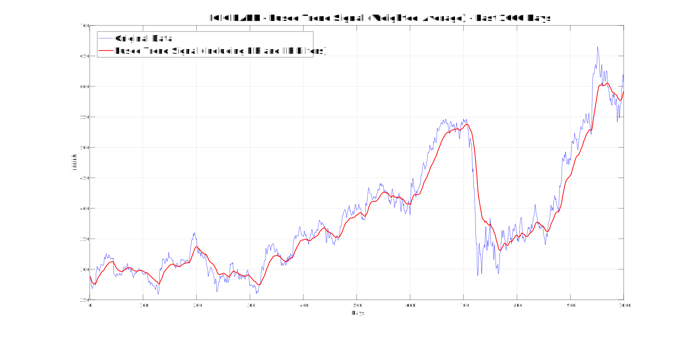
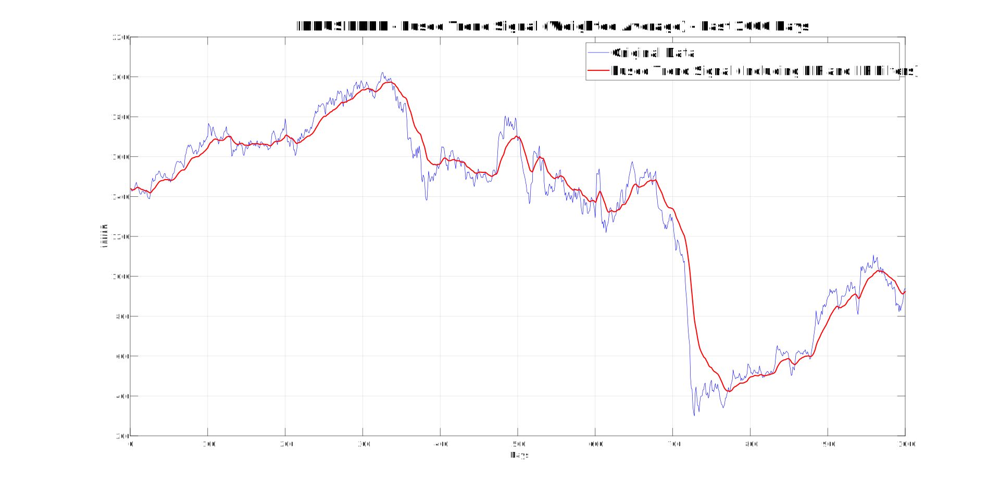
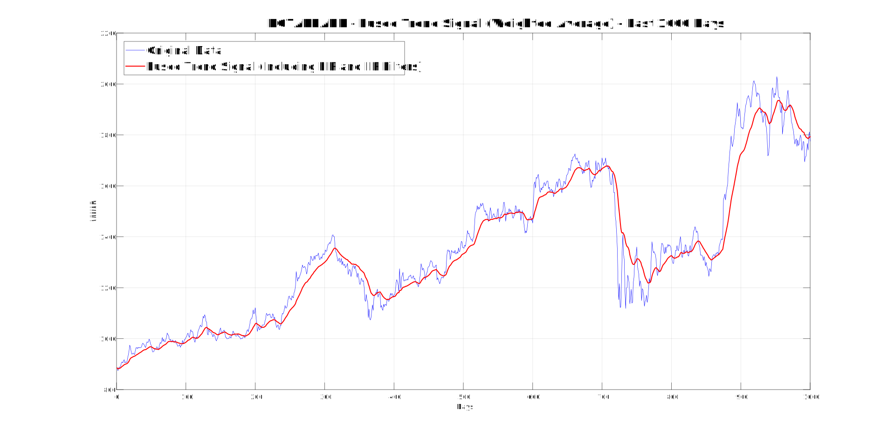

# CMPE 362 HOMEWORK 2 - Stock Trading Using DSP Techniques
* **Muhammet Emin Çiftçi, 2020400081**

## Part 1: Signal Processing for Trend Extraction

### 1.1 Simple Moving Average (FIR Filter)
* Simple moving average filter is implemented under the "Part1_12_SMA_and_EMA.m" matlab file. Window sizes varying from 5 to 60 have been chosen to test on FIR filter. Smaller values such as 5 and 10 gave more spiky graphs since predictions were widely effected by the current values. On the other hand, values such as 30 and 60 gave smoother graphs due to their generality. They access a longer time period that results in a less spiky graph. 
* You can see the graphs under the 1.2 section. The graphs include both FIR and IIR filter results with original data for each bank's data. 

### 1.2 Exponential Moving Average (IIR Filter)
* Exponential moving average filter is implemented under the "Part1_12_SMA_and_EMA.m" matlab file. By using the formula alpha = 2 / (window_size + 1), we can correlate to the window size values from SMA filter. The same values for window size were used in this part. Again, smaller values of window size gave less general views while greater values of window size resulted in more straight lines. It is important to see that alpha is inversely affected by the value of window size. Therefore, bigger alpha values resulted in spiky lines, while smaller alpha values introduced generality. 
* There are one graph for each bank stock. These graphes are consisted of three different plots: Original data, FIR filtered data, and IIR filtered data. 


* The main difference between IIR and FIR filter can be seen on this plot by looking at how the plots behave when they encounter a sudden increase or decrease on stock price. IIR filter behaves faster since it put emphasiz on the most recent values. For example, when the day 600 was hit, a significant fall on the price happened. When we zoom in to the graph, we can see that the first filter to react to it was IIR filter.  


* Again, the difference can be seen on this graph too. For example, take a look at the sudden increase in price before the day 150. The green plot (IIR filter) was always first to react to changes like these.


* The same comments can be done for this graph too. 


* The sudden increase effects can be more clearly seen on this graph. Take a look at the days between 720-730. While the green plot suddently piked do to sudden price increase in KOTAKBANK stocks, red one did not reflect to this change since the simple moving average logic does not prioritize the recent values. 

### 1.3 Suggested Model (Combinations of FIR and IIR Filters)

* The method that has been chosen for this part consists of multiples of FIR and IIR filters. After seeing the effects of both FIR and IIR filters with different window sizes, I decided on combining them and benefitting from their advantages. By using IIR filters, I will prioritize the recent values while by using FIR filters, I will gain more generality. And, when those filters have the same predictions, it would be more safe to buy or sell stocks. 

* It can be both said that this is already implemented and this is a new idea since the filters are the same filter from the first and second part of this section. However, the window sizes and different combinations of these filters have made this model somewhat original. 

* 3 different SMA filters and 2 different EMA filters are used on the model. SMA filters have 10, 30, and 60 as their window sizes. EMA filters have 10 and 20 as their window sizes. Weights of filters are chosen to be different. The most weight is put on the one with 60 as its window size since the main purpose was to catch generality.

* There are four different plots for the visualizations.









These plots are quite different from the ones on previous section since their average (with weights) is taken. Differently behaving filters are also used. Therefore, a more general and future based filter is achieved. 

## Part 2: Trading Strategy
* Trading strategy logic is implemented on "Part2.m" matlab file. It includes the filtering mechanism described on Part 1.3. 
* Pseudo-code:

```
Initialize:
    cash = 10000
    shares = 0 for each stock
    log = []

For each day from 2 to 600:
    
    # === BUYING LOGIC ===
    For each stock:
        Calculate today's trend = fused_signal_today - fused_signal_yesterday
        If trend is positive AND vote >= 4:
            Calculate trend_rate = trend / fused_signal_yesterday

            # Determine buy strength x based on trend_rate
            If trend_rate > 0.005 → x = 0.25
            Else if trend_rate > 0.003 → x = 0.10
            Else if trend_rate > 0.002 → x = 0.05
            Else → x = 0

        Else:
            x = 0
        
        Save x as trend_score for the stock

    Normalize trend_scores (sum to 1), and allocate cash:
    For each stock:
        If trend_score > 0:
            allocation = (trend_score / total_scores) * available_cash
            If allocation > 1:
                Calculate number of shares = allocation / current_price
                Update:
                    - shares += number of shares
                    - cash -= allocation
                Log: "BUY <amount> of stock"

    # === SELLING LOGIC ===
    For each stock:
        Calculate today's trend = fused_signal_today - fused_signal_yesterday
        If trend is negative AND vote <= 2 AND shares > 0:
            Calculate trend_rate = -trend / fused_signal_yesterday

            # Determine sell strength x based on trend_rate
            If trend_rate > 0.005 → x = 0.25
            Else if trend_rate > 0.003 → x = 0.10
            Else if trend_rate > 0.002 → x = 0.05
            Else → x = 0

            If x > 0:
                Calculate shares_to_sell = x * current shares
                Calculate amount = shares_to_sell * current_price
                If amount > 1:
                    Update:
                        - shares -= shares_to_sell
                        - cash += amount
                    Log: "SELL <amount> of stock"

After loop ends:
    Calculate net worth = cash + (value of all remaining shares)
```
* Trading strategy consists of two main parts: Buying logic and selling logic. In order to buy a stock, trend of that stock needs to be greater than zero and the decisions made by 5 different filters need to be similar. After passing this point, the rate of the trend needs to be on some level. According to this level, the amount of cash that is going to be used for buying that stock will be decided. For selling, pretty much the same is done but for negative values of trend. 

* The outputs from Part 1.3 directly effects the decisions made on the trading strategy. Other parts indirectly effects these decisions since Part 1.1 and Part 1.2 helped develop the hibrit algorithm. 

* The results were very promising. Given that we start with 10,000 units of currency, the implemented strategy resulted in 13788.77 currency units for 600 days of selling and buying.  

* Using different filters to decide on buying or selling with addition to trend values helped a lot on generality. With this mechanism, we did not immediately sell or buy stocks after sudden increase or decrease. Also, adding different intervals for different rates of buying or selling provided the ability to react differently even the buying or selling action is taken. These kinds of different filtering mechanisms helped manipulate the decisions. 

* Not using frequency based filters on decision making might introduced lack of correct judgement on some cases. Therefore, adding more filters with different attributes will most definitely fill the gaps on current logic. 

