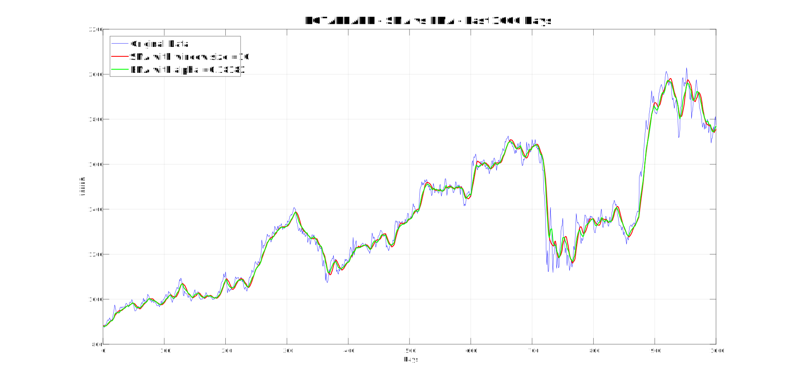

# CMPE 362 HOMEWORK 2 - Stock Trading Using DSP Techniques

## Part 1: Signal Processing for Trend Extraction

### 1.1 Simple Moving Average (FIR Filter)
* Simple moving average filter is implemented under the "Part1_12_SMA_and_EMA.m" matlab file. Window sizes varying from 5 to 60 have been chosen to test on FIR filter. Smaller values such as 5 and 10 gave more spiky graphs since predictions were widely effected by the current values. On the other hand, values such as 30 and 60 gave smoother graphs due to their generality. They access a longer time period that results in a less spiky graph. 
* You can see the graphs under the 1.2 section. The graphs include both FIR and IIR filter results with original data for each bank's data. 

### 1.2 Exponential Moving Average (IIR Filter)
* Exponential moving average filter is implemented under the "Part1_12_SMA_and_EMA.m" matlab file. By using the formula alpha = 2 / (window_size + 1), we can correlate to the window size values from SMA filter. The same values for window size were used in this part. Again, smaller values of window size gave less general views while greater values of window size resulted in more straight lines. It is important to see that alpha is inversely affected by the value of window size. Therefore, bigger alpha values resulted in spiky lines, while smaller alpha values introduced generality. 
* There are one graph for each bank stock. These graphes are consisted of three different plots: Original data, FIR filtered data, and IIR filtered data. 

### 1.3 Suggested Model (Combinations of FIR and IIR Filters)

